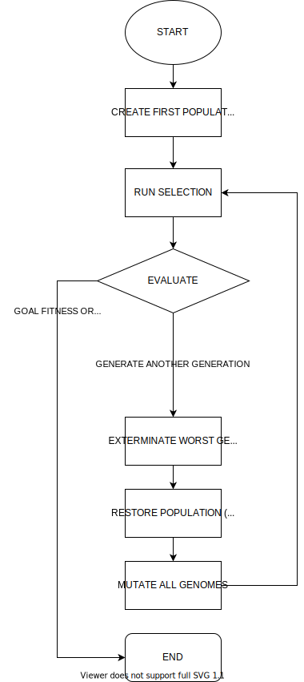

# spill-ai-neat-2 (MsPacman)
Prosjekt gruppe som lager agent som spiller spill


Anbefaler å kjøres i python 3.8 (64-bit)

### Installasjon
MsPacman kjøres på en atari gjennom Arcade Learning Environment. \
Som oftest må programmet som kjører environmentet (ale_c.dll) bli bygget på sin egen pc, men man kan forsøke å bruke filen som er inkludert i prosjektet.

1. Set opp python venv og installer nødvendige moduler

    ```
    > python -m venv venv
    > venv\Scripts\activate
    > (venv) python -m pip install -r requirements.txt
    ``` 

2. Når moduler er installert, setter man `ale_c.dll` i `.\venv\Lib\site-packages\atari_py\ale_interface`

3. Ved å kjøre `The Clever Ms PacMan.py`, starter man neuroevolusjonen

### NEAT Diagram
